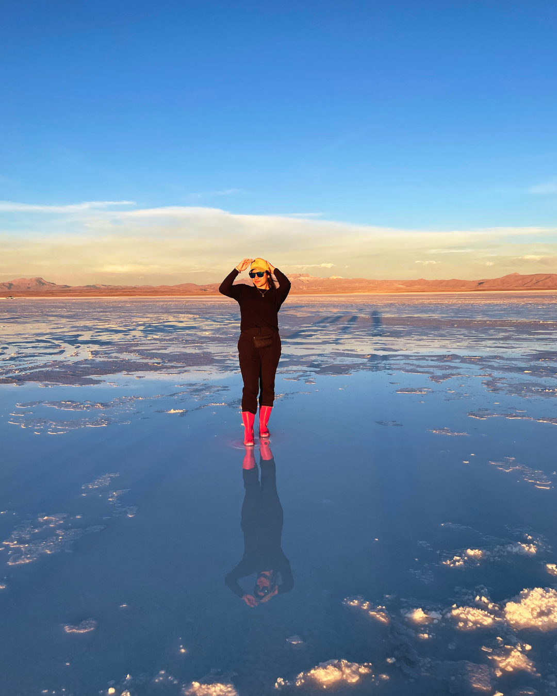

<div align="center">
  
  <h1>✈️ Travel Hero SceneScape</h1>
  <p><strong>Uma experiência imersiva de viagem com animações fluidas e design moderno</strong></p>
</div>

<div align="center">

  
  
  
  
  

</div>

## 🌟 Visão Geral

Travel Hero SceneScape é um site moderno de agência de viagens que combina design elegante com animações fluidas para criar uma experiência de usuário imersiva. Desenvolvido com as mais recentes tecnologias web, o projeto demonstra implementações avançadas de React, TypeScript e animações interativas.

<div align="center">
  
</div>

## ✨ Características

- 🎨 **Design Responsivo e Moderno** - Layout adaptável a qualquer dispositivo com estética contemporânea
- 🌊 **Animações Fluidas** - Transições suaves e efeitos visuais usando Framer Motion
- 🧩 **Componentes Reutilizáveis** - Arquitetura modular com componentes bem estruturados
- 🔍 **SEO Otimizado** - Estrutura semântica para melhor indexação
- 🌐 **Internacionalização** - Suporte para conteúdo em português
- 🔄 **Navegação Intuitiva** - Experiência de usuário fluida com React Router
- 🎭 **Efeitos Interativos** - Elementos interativos como cards com efeito tilt e botões magnéticos

## 🛠️ Stack Tecnológico

### Frontend
- **React 18** - Biblioteca JavaScript para construção de interfaces
- **TypeScript** - Superset tipado de JavaScript
- **Vite** - Build tool e dev server ultrarrápido
- **React Router** - Navegação declarativa para aplicações React
- **Framer Motion** - Biblioteca de animações para React
- **Tailwind CSS** - Framework CSS utilitário
- **Shadcn UI** - Componentes de UI reutilizáveis e acessíveis
- **Lucide Icons** - Conjunto de ícones SVG

### Ferramentas de Desenvolvimento
- **ESLint** - Linting para JavaScript/TypeScript
- **PostCSS** - Processador CSS com plugins
- **Bun** - Runtime JavaScript e gerenciador de pacotes

## 🚀 Recursos Avançados Implementados

### Hooks Personalizados
- `useMagnetic` - Efeito magnético para elementos interativos
- `useScrollAnimation` - Animações baseadas na posição de scroll
- `useMobile` - Detecção responsiva para experiências otimizadas em dispositivos móveis

### Componentes de UI Avançados
- **Particles** - Sistema de partículas para fundos dinâmicos
- **TiltCard** - Cards com efeito 3D de inclinação
- **AnimatedText** - Texto com animações de entrada personalizáveis
- **VideoHero** - Hero section com vídeo de fundo e overlay de gradiente

### Técnicas de Animação
- Animações de entrada staggered (escalonadas)
- Transições de página fluidas
- Efeitos parallax em galerias de imagens
- Animações baseadas em scroll
- Efeitos de hover avançados

## 📁 Estrutura do Projeto

```
travel-hero-scenescape/
├── public/               # Arquivos estáticos
│   ├── images/           # Imagens do site
│   └── favicon.svg       # Favicon
├── src/
│   ├── components/       # Componentes React
│   │   ├── ui/           # Componentes de UI reutilizáveis
│   │   └── ...           # Componentes específicos da aplicação
│   ├── hooks/            # Hooks personalizados
│   ├── lib/              # Utilitários e constantes
│   ├── pages/            # Componentes de página
│   ├── styles/           # Estilos CSS
│   ├── App.tsx           # Componente principal
│   └── main.tsx          # Ponto de entrada
├── index.html            # Template HTML
├── tailwind.config.ts    # Configuração do Tailwind
└── package.json          # Dependências e scripts
```

## 🖥️ Páginas Principais

- **Início** - Landing page com hero section em vídeo e destaques
- **Sobre** - História e valores da agência
- **Destinos** - Catálogo de destinos com cards interativos
- **Guias e Recursos** - Dicas de viagem e recursos úteis
- **Contato** - Formulário de contato e informações

## 🧠 Padrões e Práticas

- **Atomic Design** - Estrutura de componentes baseada em princípios de design atômico
- **CSS-in-JS** - Estilização dinâmica com Tailwind e classes condicionais
- **Lazy Loading** - Carregamento otimizado de imagens e componentes
- **Composição de Componentes** - Padrões avançados de composição React
- **Renderização Condicional** - UI adaptativa baseada em estado e contexto

## 📸 Capturas de Tela

Para adicionar mais capturas de tela do seu projeto:

1. Capture imagens impressionantes do seu site
2. Salve-as em `public/images/`
3. Adicione-as a este README usando a sintaxe:

```md
<div align="center">
  
</div>
```

## 🚀 Como Executar

```bash
# Instalar dependências
npm install

# Iniciar servidor de desenvolvimento
npm run dev

# Construir para produção
npm run build

# Visualizar build de produção
npm run preview
```

## 🤝 Contribuição

Contribuições são bem-vindas! Sinta-se à vontade para abrir issues ou enviar pull requests.

## 📄 Licença

Este projeto está licenciado sob a [MIT License](LICENSE).

---

<div align="center">
  <p>Desenvolvido com ❤️ por Travel Hero Team</p>
</div>
